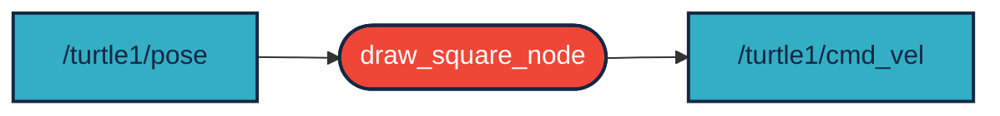

# `koc_oj4` package
A package egy node-ból áll, ez a turtlesim szimulátorban képes egy négyzet kirajzolására. A hirdetett topic /turtle1/cmd_vel/twist típusú, míg a topic, amit az elfordulás érzékelésére alkalmaz az a /turtle1/pose. A megvalósítás ROS 2 Humble alatt történik.
ROS 2 python package.  [](https://docs.ros.org/en/humble/)
## Packages and build

It is assumed that the workspace is `~/ros2_ws/`.

### Clone the packages
``` r
cd ~/ros2_ws/src
```
``` r
git clone https://github.com/Kocsi-HorvathMartin/koc_oj4
```

### Build ROS 2 packages
``` r
cd ~/ros2_ws
```
``` r
colcon build --packages-select koc_oj4 --symlink-install
```

<details>
<summary> Don't forget to source before ROS commands.</summary>

``` bash
source ~/ros2_ws/install/setup.bash
```
</details>

``` r
ros2 launch koc_oj4 draw_square.launch.py
```
### Graph

