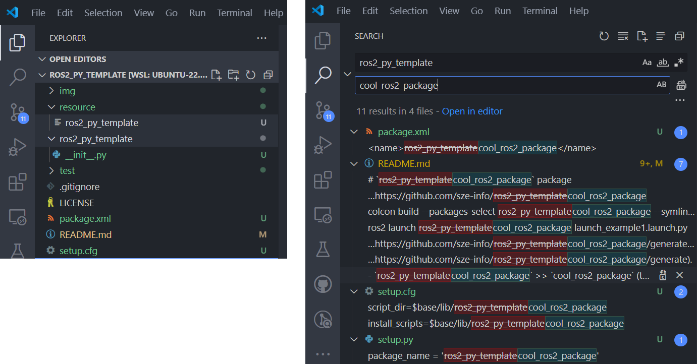

# `koc_oj4` package
ROS 2 python package.  [](https://docs.ros.org/en/humble/)
## Packages and build

It is assumed that the workspace is `~/ros2_ws/`.

### Clone the packages
``` r
cd ~/ros2_ws/src
```
``` r
git clone https://github.com/Kocsi-HorvathMartin/koc_oj4
```

### Build ROS 2 packages
``` r
cd ~/ros2_ws
```
``` r
colcon build --packages-select koc_oj4 --symlink-install
```

<details>
<summary> Don't forget to source before ROS commands.</summary>

``` bash
source ~/ros2_ws/install/setup.bash
```
</details>

``` r
ros2 launch koc_oj4 launch_example1.launch.py
```

# Delete this part if you are using it as a template

ROS 2 pacage template, to get started, use template by clicking on the Green button labeled [`Use this template`](https://github.com/Kocsi-HorvathMartin/koc_oj4/generate) / [`Create new repository`](https://github.com/Kocsi-HorvathMartin/koc_oj4/generate). 

<p align="center"></p>


Let's assume 
- your Github username is `Kocsi-HorvathMartinoolusername`
- your ROS 2 repo shold be `koc_oj4`

Replace everything in the cloned repo:

- `koc_oj4` >> `koc_oj4` (the folder was already renamed after `Use this template`)
- `Kocsi-HorvathMartin` >> `Kocsi-HorvathMartinoolusername`
- find all `todo` strings and fill the blanks

The easiest way is VS code:

<p align="center"></p>

> [!IMPORTANT]  
> Don't forget to rename the directory (folder) and the file too.

Now `colcon build` your ROS 2 package and you can start wokring.